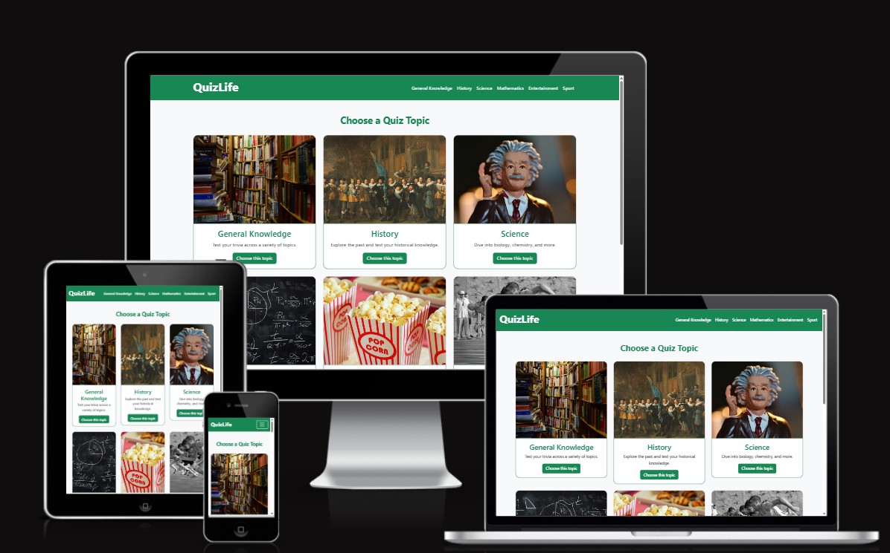
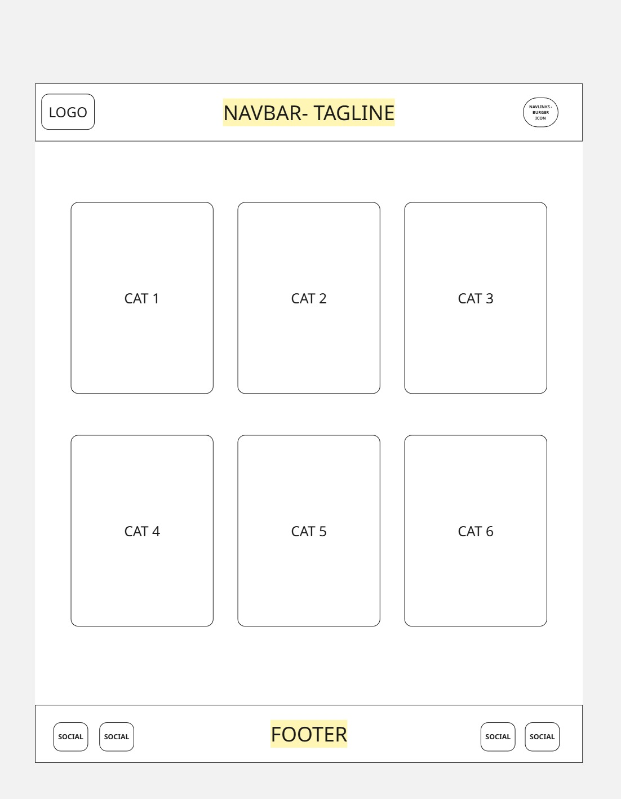
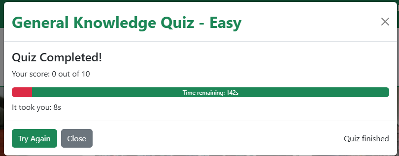
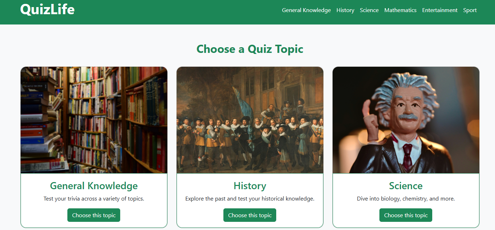
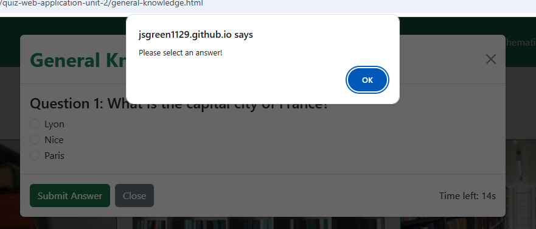
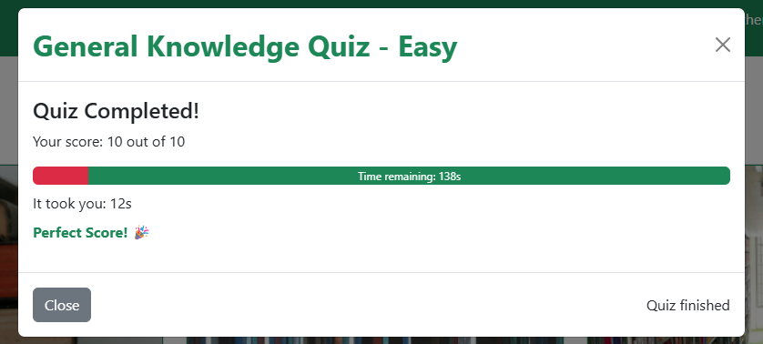
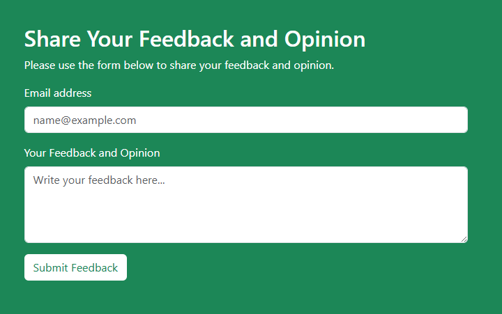
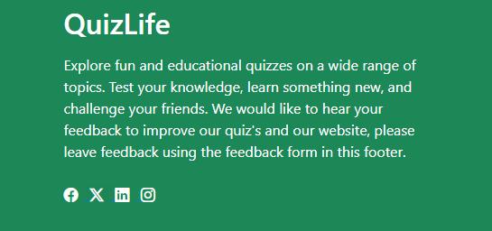
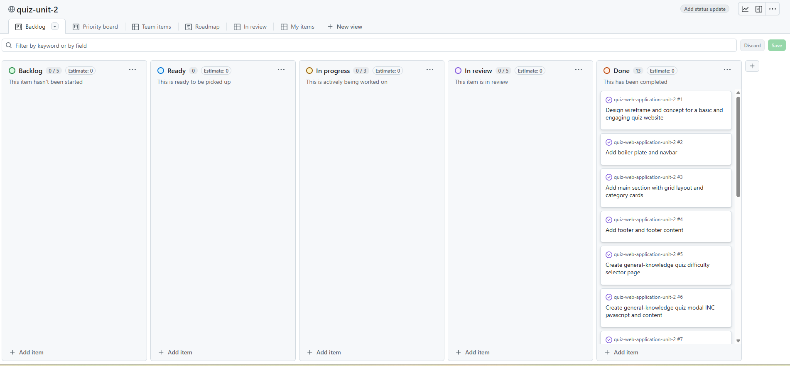

# [quiz-web-application-unit-2](https://jsgreen1129.github.io/quiz-web-application-unit-2)

Developer: Josh Green ([JSGREEN1129](https://www.github.com/JSGREEN1129))

## Project Rationale
QuizLife was developed to provide a fun, accessible, and informative platform for users to test and improve their knowledge across a range of topics. The core purpose is to offer a quick and enjoyable mental break — whether for individual use, competitive fun with friends, or casual learning. This addresses the growing need for interactive, low-effort digital experiences that fit into everyday routines.

**QuizLife is designed for:**

- Casual users who want a quick mental challenge in their free time.
- Students or learners looking to reinforce knowledge through repetition and immediate feedback.
- Social groups or families wanting an entertaining activity during gatherings.
- Mobile users who prefer lightweight, responsive web apps on the go.
- Users with accessibility needs, such as visual impairments, who benefit from high-contrast colors and readable fonts.

**User Needs and Stories**
To ensure the platform meets real user needs, several user stories were defined and implemented in development:
[user-stories](#user-stories)

**Site Mockups**

source: [quiz-web-application-unit-2 amiresponsive](https://ui.dev/amiresponsive?url=https://jsgreen1129.github.io/quiz-web-application-unit-2)

## UX

### The 5 Planes of UX

#### 1. Strategy

**Purpose**
- Provide users with a simple and accessible way to partake in quizzes on a range of topics and difficulties.
- Deliver instant feedback to keep users engaged and encouraged to reengage.
- Support device based accessibility and device-friendly navigation and interactions.

**Primary User Needs**
- Ease of Access: Users want a simple, fast, and hassle-free way to engage with content that entertains or stimulates their minds.
- Social Enjoyment: Users want a way to enjoy quizzes together in group settings, encouraging interaction, laughter, and friendly rivalry.
- Content Variety: Users want access to a wide range of quiz topics and formats to keep the experience fresh and interesting over multiple visits.

**Business Goals**
- Boost Engagement & Retention: Encourage both casual and repeat usage by delivering an enjoyable and smooth user experience for entertainment and light learning.
- Demonstrate Quality & Accessibility: Position the platform as a well-designed, inclusive tool that highlights good design practices and supports a wide user base across devices.
- Lay Foundations for Growth: Create a scalable structure that can evolve with new features (e.g., user accounts, multiplayer modes, or content sharing) and support potential monetization or community expansion.

#### 2. Scope

**[Features](#features)** (see below)

**Content Requirements**
- Clear UI Labels & Instructions: All input fields, answer options, and navigation buttons must be clearly labeled to ensure user interaction.
- Input Validation & Error Feedback: The system should detect and display helpful error messages for invalid or incomplete inputs, guiding users toward correct usage.
- Real-Time Feedback: Quiz results and answers should be calculated and displayed instantly to maintain user engagement and learning momentum.
- Performance Statistics: A running summary should track and display user performance—such as correct vs. incorrect answers—to provide insights and encourage improvement over time.

#### 3. Structure

**Information Architecture**
- **Navigation Menu**:
  - An accessible and responsive navigation bar to provide users with clear access to different quiz topics.
- **Hierarchy**:
  - Primary Focus Areas: Quiz questions and answer options are placed prominently in a dynamic quiz modal at the center of the interface to guide the user's attention and interaction.
  - Feedback Display: Scores are shown clearly at the end of the quiz and a confetti success animation while trigger for a perfect 10/10 score.
  - Dynamic Try Again btn: If a user scores less than a perfect score then the btn inside the quiz modal while dynamically be displayed as a 'Try Again' btn to encourage additional user engagement.
  - A time ticker: A time ticker will be present so the user can see how long they have left to answer the question until the quiz modal automatically moves to the next question.
  - A final score progress bar: At the end of the quiz, as well as a final score, there will be a progress bar indicating how long it took the user to complete the questions and how much time they had left.

**User Flow**
1. User lands on the Home Page and reads a brief introduction or instructions about how to start a quiz.
2. IUser selects a quiz category and is directed to the difficulty selector page.
3. The user answers each question inside a dictated timeframe by selecting from multiple-choice options. Submitting their answer with a 'Submit Answer' btn.
4. Once the user has completed the quiz the user is presented with a summary of results, including score, time taken to complete the quiz and how much time was remaining.
5. If the user scores less than a perfect score then they can start the quiz again with a 'Try Again' btn.

#### 4. Skeleton

**[Wireframes](#wireframes)** (see below)

#### 5. Surface

**Visual Design Elements**
- **[Colours](#colour-scheme)** (see below)
- **[Typography](#typography)** (see below)

### Colour Scheme

- `#000000` Background - Main site background, providing strong contrast and a modern, sleek appearance.
- `#188754` Primary Accent - Main brand color used for buttons, highlights, and interactive elements.
- `#FFFFFF` Primary Text - Default text color, ensuring high contrast and readability against dark background.
- `#188754` Secondary Text - Used for subheadings, links, or subtle highlights — consistent with brand color.
- `#000000` Tertiary Text - For use on light elements or backgrounds where black text offers contrast.

### Typography

- I used the default font styles applied via bootstrap 5.3. I believe these to be a combination of the below.

- [system-ui]
- [-apple-system]
- [-Roboto]
- [Arial]
- [sans-serif]

## Wireframes

| Page | Mobile | Tablet | Desktop |
| --- | --- | --- | --- |
| Home |  |  |  |
| Quiz modal |  |  |  |

### User Stories

| Target | Expectation | Outcome | Proof |
| --- | --- | --- | --- |
| As a user | I would like to browse and select from different quiz categories | so that I can choose topics that align with my interests and knowledge areas, making the quiz experience more engaging and personally relevant. |  |
| As a user | I would like to answer multiple-choice questions | so that I can test my knowledge in a structured and user-friendly way without feeling overwhelmed by open-ended inputs. |  |
| As a user | I would like the quiz interface to be clear and mobile-friendly | so that I can participate in quizzes smoothly whether I'm using a phone, tablet, or desktop, and get my results quickly without unnecessary delays or confusion. |  |
| As a user | I would like to replay quizzes or start new ones quickly | so that I can keep playing, improving, and challenging myself without navigating through multiple steps or menus. |  |
| As a user | I would like the application to have high-contrast colors and accessible fonts | so that I can easily read questions and answers, especially if I have visual impairments or am in a bright or low-light environment. |  |
| As a user | I would like the app to show an error message if I skip a question or input is incomplete | so that I understand what action is needed and don’t miss out on submitting my answers correctly. |  |
| As a user | I would like a final score to be presented at the end of each quiz | so that I can measure how well I performed, review my answers, and track my learning progress over time. |   |

## Features

### Existing Features

| Feature | Notes | Screenshot |
| --- | --- | --- |
| Responsive navbar | The navbar is responsive on both smaller and larger screens for ease of use, website fluency and improved user experience |  |
| Feedback and Opinion form | A section in the footer for users to submit their feedback and opinions to help sculpt the website to meet user demand and requirements |  |
| Social Links | Links for users to navigate to social pages (In future could be used to share scores and invite other users to compete) |  |
| Topic selection | This section allows users to choose from a selection of topics to suite their interests. (Could be expand in the future to included more topics.) |  |
| Difficulty selector | A difficulty selector presented after the topic has been choosen, difficulty indicated by a value of star favicons and text |  |
| Multiple choice answers | Multiple choice answers to ease pressure on the user |  |
| Time ticker | A time ticker to ensure the user moves through the content in good time and remains engaged |  |
| End of quiz feedback presentation | MA end of quiz feedback presentation telling the user how many questions they answered correctly, how much time they had remaining and how long it took them to complete the quiz |  |
| Confetti animation | A confetti animation is triggered on the quiz end screen when a user gets a perfect score |  |

### Future Features

- **User login and authentication**: Allow users to create accounts to save quiz history, track progress, and access personalized quiz content.
- **Topic and Difficulty completion state**: Visually indicate which topics and difficulty levels have been completed, along with performance summaries.
- **Highscore/time to completion tracking**: Enable logged-in users to record and view their best scores and fastest quiz completion times per topic and difficulty level.
- **Achievements and Badges**: Reward users with badges for milestones such as “Perfect Score”, “First Quiz Completed”, “Speed Demon”, and more.
- **Leaderboard**: Showcase top scorers across the platform or by topic, with optional filters like “Today”, “This Week”, or “All Time”.
- **More Topic Categories**: Expand the selection of quiz topics to include history, science, geography, pop culture, music, movies, tech, and more.
- **Multiplayer or Challenge Friends Mode**: Let users invite friends to take the same quiz and compare results, or play head-to-head in real-time.
- **Hints and Lifelines**: Add optional lifelines like “50/50”, “Skip Question”, or “Get a Hint” to increase quiz strategy and engagement.
- **Question of the Day**: Feature a daily quiz question to encourage regular engagement and return visits.
- **Score Sharing to Social Media**: Allow users to share their quiz results or badges directly on platforms like Twitter, Facebook, or Instagram.

## Tools & Technologies

| Tool / Tech | Use |
| --- | --- |
|  | Generate README and TESTING templates. |
|  | Version control. (`git add`, `git commit`, `git push`) |
|  | Secure online code storage. |
|  | Local IDE for development. |
|  | Main site content and layout. |
|  | Design and layout. |
|  | User interaction on the site. |
|  | Hosting the deployed front-end site. |
|  | Help debug, troubleshoot, and explain things. |
|  | Tutorials/Reference Guide |
|  | Troubleshooting and Debugging |

## Agile Development Process

### GitHub Projects

[GitHub Projects](https://www.github.com/JSGREEN1129/quiz-web-application-unit-2/projects) served as an Agile tool for this project. Through it, EPICs, User Stories, issues/bugs, and Milestone tasks were planned, then subsequently tracked on a regular basis using the Kanban project board.

### MoSCoW Prioritization

I've decomposed my Epics into User Stories for prioritizing and implementing them. Using this approach, I was able to apply "MoSCoW" prioritization and labels to my User Stories within the Issues tab.

- **Must Have**:
I would like to browse and select from different quiz categories.
I would like to answer multiple-choice questions.
I would like the quiz interface to be clear and mobile-friendly.

- **Should Have**:
I would like the app to show an error message if I skip a question or input is incomplete.

- **Could Have**: 
I would like to replay quizzes or start new ones quickly.

## Testing

There are two methods of testing, Automated Testing and Manual Testing. 

**Automated Testing** is the use of scripts and tools to test written code and compare the results to the expected outcomes. There a various tools that can be used and there are a number of reasons why automatic testing could and should be used. It automates the process of validating the functionality of software and web applications.

**Tools for Automation Testing**

- **Selenium:** Open-source web automation for multiple browsers and languages.
- **BrowserStack Automate:** Runs tests on 3,500+ real devices and browsers with top frameworks.
- **BrowserStack App Automate:** Mobile app testing on real Android & iOS devices.
- **Cucumber:** BDD tool for human-readable automated tests.
- **Appium:** Cross-platform mobile automation for Android & iOS.
- **Percy:** Visual regression testing for UI consistency.
- **App Percy:** Mobile app visual testing on real devices.

**Manual Testing** refers to a test process in which a QA manually tests the software application to identify bugs. To do so, QAs follow a written test plan that describes a set of unique test scenarios. The QA is required to analyse the performance of the web or mobile application from an end user’s perspective.

**Characteristics of Manual Testing are:**

- **Human Involvement:** Testers manually execute test cases without automation tools.
- **Exploratory Testing:** Allows testers to explore new functionalities and test beyond scripted cases.
- **Adaptive Testing:** Enables immediate responses to unexpected behaviors in the software.
- **Time-Intensive:** Requires time to execute test cases manually, particularly in large systems.
- **Visual Feedback:** Ensures that the user interface is visually aligned with user expectations.
- **Hands-on Understanding:** Provides deeper insights into the system’s real-time behavior and usability.

To verify my project's functionality I have used a mixture of both testing methods. Automatic Testing by the way of HTML, CSS and JavaScript validators and also, Lighthouse reports. Manual Testing to validate that each hyperlink works correctly and that there are no broken links. You can find the results in the TESTING.md document. 

> [!NOTE]
> For all testing, please refer to the [TESTING.md](TESTING.md) file.

## Deployment

### GitHub Pages

The site was deployed to GitHub Pages. The steps to deploy are as follows:

- In the [GitHub repository](https://www.github.com/JSGREEN1129/quiz-web-application-unit-2), navigate to the "Settings" tab.
- In Settings, click on the "Pages" link from the menu on the left.
- From the "Build and deployment" section, click the drop-down called "Branch", and select the **main** branch, then click "Save".
- The page will be automatically refreshed with a detailed message display to indicate the successful deployment.
- Allow up to 5 minutes for the site to fully deploy.

The live link can be found on [GitHub Pages](https://jsgreen1129.github.io/quiz-web-application-unit-2).

### Local Development

This project can be cloned or forked in order to make a local copy on your own system.

#### Cloning

You can clone the repository by following these steps:

1. Go to the [GitHub repository](https://www.github.com/JSGREEN1129/quiz-web-application-unit-2).
2. Locate and click on the green "Code" button at the very top, above the commits and files.
3. Select whether you prefer to clone using "HTTPS", "SSH", or "GitHub CLI", and click the "copy" button to copy the URL to your clipboard.
4. Open "Git Bash" or "Terminal".
5. Change the current working directory to the location where you want the cloned directory.
6. In your IDE Terminal, type the following command to clone the repository:
	- `git clone https://www.github.com/JSGREEN1129/quiz-web-application-unit-2.git`
7. Press "Enter" to create your local clone.

Alternatively, if using Gitpod, you can click below to create your own workspace using this repository.

**Please Note**: in order to directly open the project in Gitpod, you should have the browser extension installed. A tutorial on how to do that can be found [here](https://www.gitpod.io/docs/configure/user-settings/browser-extension).

#### Forking

By forking the GitHub Repository, you make a copy of the original repository on our GitHub account to view and/or make changes without affecting the original owner's repository. You can fork this repository by using the following steps:

1. Log in to GitHub and locate the [GitHub Repository](https://www.github.com/JSGREEN1129/quiz-web-application-unit-2).
2. At the top of the Repository, just below the "Settings" button on the menu, locate and click the "Fork" Button.
3. Once clicked, you should now have a copy of the original repository in your own GitHub account!

### Local VS Deployment

There are no remaining major differences between the local version when compared to the deployed version online.

## Credits

I used various tools to help me with this assignment, I have listed them below and provided direct links where possible.

| Source | Notes |
| --- | --- |
| [compress-or-die](https://compress-or-die.com/) | compressing image files |
| [codesistency](https://www.youtube.com/@codesistency) | help with writing code and learning practicalities |
| [julio codes](https://www.youtube.com/c/JulioCodes) | help with writing code and learning practicalities |
| [learn web dev with norbert](https://www.youtube.com/@NorbertWebDev) | help with writing code and learning practicalities |
| [web cifar](https://www.youtube.com/@webcifar) | help with writing code and learning practicalities |
| [beautifier.io](https://beautifier.io/) | help correctly formatting code |
| [greatstack](https://greatstack.dev/) | help with writing code and learning practicalities |
| [adobe](https://www.adobe.com/express/feature/image/resize) | compressing image files |

### Content

| Source | Notes |
| --- | --- |
| [Markdown Builder](https://markdown.2bn.dev) | Help generating Markdown files |
| [Interactive Frontend Development](https://codeinstitute.net) | Code Institute walkthrough project inspiration |
| [WebDevSimplified](https://www.youtube.com/watch?v=riDzcEQbX6k) | Inspiration for a quiz app |
| [JavaScript30](https://javascript30.com) | Additional JS help |
| [Bootstrap](https://getbootstrap.com) | Various components / responsive front-end framework |
| [ChatGPT](https://chatgpt.com) | Help with code logic and explanations |

### Media

- Images
    - [Pexels](https://www.pexels.com)
    - [Unsplash](https://unsplash.com)
    - [LottieFiles](https://lottiefiles.com)

### Acknowledgements

- I would like to thank my Code Institute mentor, [Tim Nelson](https://www.github.com/TravelTimN) for the support throughout the development of this project.
- I would like to thank the [Code Institute](https://codeinstitute.net) Tutor Team for their assistance with troubleshooting and debugging some project issues.
- I would like to thank the [Code Institute Slack community](https://code-institute-room.slack.com) for the moral support; it kept me going during periods of self doubt and impostor syndrome.
- I would like to thank my partner, for believing in me, and allowing me to make this transition into software development.
- I would like to thank my employer, for supporting me in my career development change towards becoming a software developer.

