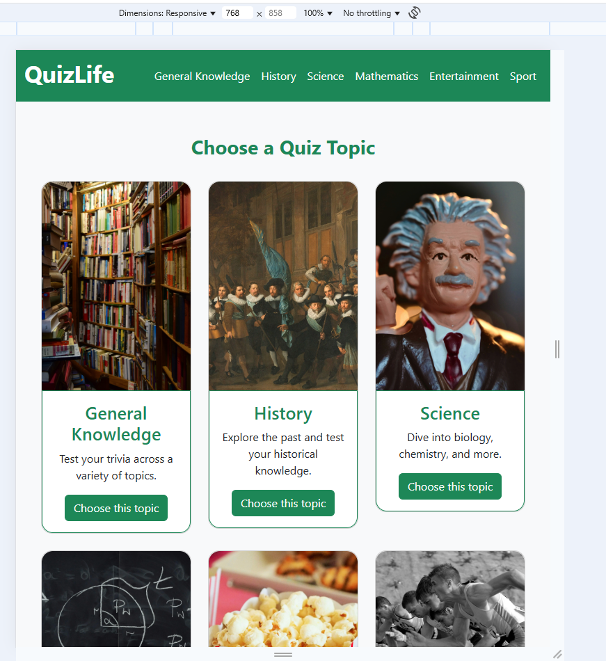
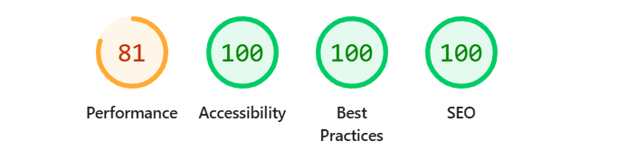

# Testing

> [!NOTE]
> Return back to the [README.md](README.md) file.

### HTML

I have used the recommended [HTML W3C Validator](https://validator.w3.org) to validate all of my HTML files.

| Directory | File | URL | Screenshot |
| --- | --- | --- | --- |
| main | [index.html](https://github.com/JSGREEN1129/quiz-web-application-unit-2/blob/main/index.html) | [HTML Validator](https://validator.w3.org/nu/?doc=https://jsgreen1129.github.io/quiz-web-application-unit-2/index.html) |  |
| main | [general-knowledge.html](https://github.com/JSGREEN1129/quiz-web-application-unit-2/blob/main/general-knowledge.html) | [HTML Validator](https://validator.w3.org/nu/?doc=https://jsgreen1129.github.io/quiz-web-application-unit-2/general-knowledge.html) |  |
| main | [history.html](https://github.com/JSGREEN1129/quiz-web-application-unit-2/blob/main/history.html) | [HTML Validator](https://validator.w3.org/nu/?doc=https://jsgreen1129.github.io/quiz-web-application-unit-2/history.html) |  |
| main | [science.html](https://github.com/JSGREEN1129/quiz-web-application-unit-2/blob/main/science.html) | [HTML Validator](https://validator.w3.org/nu/?doc=https://jsgreen1129.github.io/quiz-web-application-unit-2/science.html) |  |
| main | [mathematics.html](https://github.com/JSGREEN1129/quiz-web-application-unit-2/blob/main/mathematics.html) | [HTML Validator](https://validator.w3.org/nu/?doc=https://jsgreen1129.github.io/quiz-web-application-unit-2/mathematics.html) |  |
| main | [entertainment.html](https://github.com/JSGREEN1129/quiz-web-application-unit-2/blob/main/entertainment.html) | [HTML Validator](https://validator.w3.org/nu/?doc=https://jsgreen1129.github.io/quiz-web-application-unit-2/entertainment.html) |  |
| main | [sport.html](https://github.com/JSGREEN1129/quiz-web-application-unit-2/blob/main/sport.html) | [HTML Validator](https://validator.w3.org/nu/?doc=https://jsgreen1129.github.io/quiz-web-application-unit-2/sport.html) |  |

### JAVASCRIPT

| Directory | File | URL | Screenshot |
| --- | --- | --- | --- |
| assets/javascript | [script.js](https://github.com/JSGREEN1129/quiz-web-application-unit-2/blob/main/assets/javascript/script.js) | [JSLint Validator](https://www.jslint.com/) |  |

### CSS

- https://jigsaw.w3.org/css-validator/validator?uri=https://jsgreen1129.github.io/quiz-web-application-unit-2
I have used the recommended [CSS Jigsaw Validator](https://jigsaw.w3.org/css-validator) to validate all of my CSS files.

| Directory | File | URL | Screenshot | Notes |
| --- | --- | --- | --- | --- |
| assets | [stylesheet.css](https://github.com/JSGREEN1129/quiz-web-application-unit-2/blob/main/assets/stylesheet/stylesheet.css) | [CSS Validator](https://jigsaw.w3.org/css-validator/validator?uri=https://jsgreen1129.github.io/quiz-web-application-unit-2) |  | Notes (if applicable) |

## Responsiveness

I've tested my deployed project to check for responsiveness issues.

| Page | Mobile | Tablet | Desktop | Notes |
| --- | --- | --- | --- | --- |
| Home |  |  |  | Works as expected |
| topic selection |  |  |  | Works as expected |
| modal |  |  |  | Works as expected |

## Browser Compatibility

I've tested my deployed project on multiple browsers to check for compatibility issues.

| Browser | Index | Topic selection | Modal |
| --- | --- | --- | --- |
| Google |  |  |  | Works as expected |
| Microsoft Edge |  |  |  | Works as expected |
| Opera |  |  |  | Works as expected |

## Lighthouse Audit

| Page | Mobile | Desktop |
| --- | --- | --- |
| Home |  |  |
| topic selection |  |  |

## Bugs

### Fixed Bugs

I've used [GitHub Issues](https://www.github.com/JSGREEN1129/quiz-web-application-unit-2/issues) to track and manage bugs and issues during the development stages of my project.

All previously closed/fixed bugs can be tracked [here](https://github.com/JSGREEN1129/quiz-web-application-unit-2/issues?q=is%3Aissue%20state%3Aclosed).

> [!IMPORTANT]
> There are no remaining bugs that I am aware of, though, even after thorough testing, I cannot rule out the possibility.
